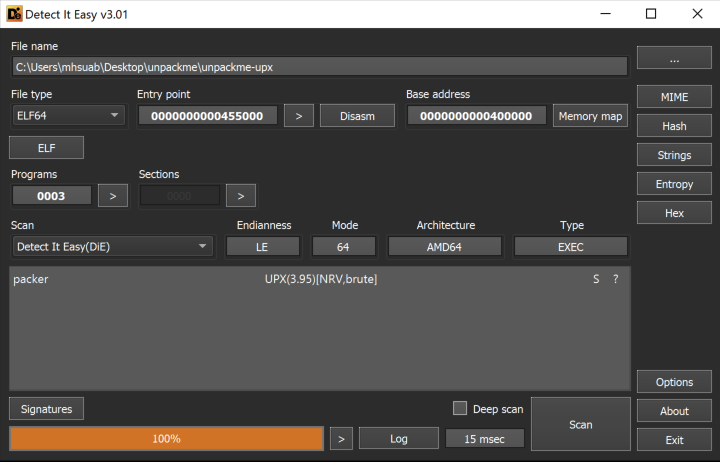

# unpackme
> Event: `picoCTF 2022`  
> Challenge: [link](https://play.picoctf.org/challenges/313/)

## Description
> Can you get the flag?

## What It Does
Ask for a favorite number and return "Sorry, that's not it!" or flag based on the input number.

## Solution
1. Use `Detect It Easy` to scan  
    
    - packed with `UPX`
2. Download [UPX](https://github.com/upx/upx) and decompress the binary
    ```bash
    $ upx -d unpackme-upx
                        Ultimate Packer for eXecutables
                            Copyright (C) 1996 - 2020
    UPX 3.96w       Markus Oberhumer, Laszlo Molnar & John Reiser   Jan 23rd 2020

            File size         Ratio      Format      Name
    --------------------   ------   -----------   -----------
    1002408 <-    379108   37.82%   linux/amd64   unpackme-upx

    Unpacked 1 file.
    ```
3. Inspect the assembly, `main` function
    - binary has logic similar to challenge, [bbbbloat](./../bbbbloat/), with slight difference:
        ```diff
        -cmp    eax,0x86187
        +cmp    eax,0xB83CB
        ```
4. Run the program and input, `754635`, as favorite number to get the **flag**